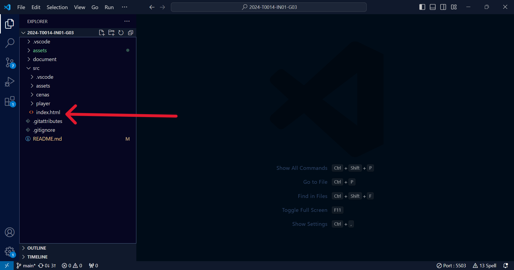

# Inteli - Instituto de Tecnologia e Liderança

<p align="center">
<a href= "https://www.inteli.edu.br/"></a>
</p>


[](https://git.io/typing-svg)


<br>

# Tyler's Supplier Journey - Uma jornada pelo metaverso

## 💫 COMETA

## 👨‍🎓 Integrantes:

<div align="center">
  <table>
    <tr>
      <td align="center"><a href="https://www.linkedin.com/in/bernardo-meirelles-117243241/"><br><sub><b>Bernardo M.</b></sub></a></td>
      <td align="center"><a href="https://www.linkedin.com/in/bruno-jancso-fabiani-0272532b3/"><br><sub><b> Bruno Fabiani</b></sub></a></td>
      <td align="center"><a href="https://www.linkedin.com/in/isadora-gatto-0900a9283?utm_source=share&utm_campaign=share_via&utm_content=profile&utm_medium=ios_app"><br><sub><b>Isadora Gatto</b></sub></a></td>
      <td align="center"><a href="https://www.linkedin.com/in/marcoruas/"><br><sub><b>Marco Peixoto</b></sub></a></td>
       <td align="center"><a href="https://www.linkedin.com/in/tainacortez/"><br><sub><b>Rafael Barbosa</b></sub></a></td>
      <td align="center"><a href=""><br><sub><b>Tainá Cortez</b></sub></a></td>
      <td align="center"><a href="https://www.linkedin.com/in/wildis-filho/"><br><sub><b>Wildisley Filho</b></sub></a></td>

  </table>
</div>

## 👩‍🏫 Professores:

### Orientador(a)

- <a href="https://www.linkedin.com/in/marcelo-gon%C3%A7alves-phd-a550652/">Marcelo Gonçalves</a>

### Instrutores

- <a href="https://www.linkedin.com/in/bruna-mayer-00a556174/">Bruna Mayer</a>
- <a href="https://www.linkedin.com/in/egondaxbacher/">Egon Daxbacher</a>
- <a href="https://www.linkedin.com/in/filipe-gonçalves-08a55015b/">Filipe Gonçalves</a>
- <a href="https://www.linkedin.com/in/fillipe-resina-b2211a22/">Fillipe Resina</a>
- <a href="https://www.linkedin.com/in/kizzyterra/">Kizzy Terra</a>
- <a href="https://www.linkedin.com/in/ricardo-josé-missori/">Ricardo Missori</a>

## 📜 Descrição

O presente projeto consiste de um jogo desenvolvido por estudantes do primeiro ano dos cursos de graduação de ciências da computação, engenharia da computação, engenharia de software e sistemas da informação do [Inteli - Instituto de Tecnologia e Liderança](https://www.inteli.edu.br/), em parceria com a empresa [Meta](https://about.meta.com/br/). Este trabalho tem como objetivo a criação de um jogo para a empresa parceira que possa auxiliá-la no momento de treinamento de novos colaboradores sobre o processo de contratação de fornecedores.

Partindo da proposta supracitada, desenvolveu-se um jogo no estilo _rpg topdown_ que mescla elementos de alta tecnologia com um mundo fantástico sem perder de vista o objetivo primário de fornecer um treinamento inicial aos colaboradoras da Meta.

[🎮 Acesse nosso jogo aqui!](https://inteli-college.github.io/2024-T0014-IN01-G03/)

## 📁 Estrutura de pastas

Dentre os arquivos e pastas presentes na raiz do projeto, definem-se:

- <b>assets</b>: aqui estão os arquivos relacionados a elementos não-estruturados deste repositório, como imagens.

- <b>document</b>: aqui estão todos os documentos do projeto, como o Game Development Document (GDD) bem como documentos complementares, na pasta "other".

- <b>src</b>: Todo o código fonte criado para o desenvolvimento do projeto do jogo.

- <b>README.md</b>: arquivo que serve como guia e explicação geral sobre o projeto e o jogo (o mesmo que você está lendo agora).

## 🔧 Como executar o código

### Pré-requisitos

Para a execução do código em uma máquina local, são necessários uma série de softwares e arquivos. Segue uma lista com os softwares e o link para sua instalação:

**Github e Git**

O [Github](https://github.com/) é uma ferramenta online que permite armazenar e organizar o versionamento de código na forma de repositórios. Dessa maneira, desenvolvedores são capazes de gerenciar versões dos seus projetos e contribuir com edições, apontar erros e tantas outras possibilidades.

Utiliza-se o Git como sistema para realizar o versionamento de código que o Github armazena. Faça o download do Git clicando [aqui](https://git-scm.com/downloads).

**Visual Studio Code**

O [Visual Studio Code](https://code.visualstudio.com/) é um editor de código que utilizaremos para executar nosso código.

Faça o download do software clicando [aqui](https://code.visualstudio.com/), em caso de dúvidas, confira [neste link](https://code.visualstudio.com/learn/get-started/basics) como fazer o download e o _setup_ básico do Visual Studio Code.

**Live server**

O Live Server é uma extensão do Visual Studio Code que cria um servidor local para a execução e visualização de páginas web.

Dentro do Visual Studio Code, pesquise por "Live Server" através da página de extensões (Figura 1). E, em seguida, efetue o download da extensão como indicado (Figura 2). 

<div align="center">
<sup> Figura 1 - Localização da aba de extensões</sup> <br>
 <br>
<sup> Fonte: Material produzido pelos autores, 2024</sup>
</div>

<div align="center">
<sub> Figura 2 - Instalando Live Server</sub> <br>
 <br>
<sub> Fonte: Material produzido pelos autores, 2024</sub>
</div> <br>

Cabe ressaltar que podem haver diferenças visuais, tais como cores e fontes, nos softwares, derivadas de modificações e personalizações, entretanto, o posicionamento das abas será o mesmo em qualquer dispositivo.


### Como executar
Siga os passos descritos abaixo para executar o jogo em seu dispositivo:

**Clonar repositório**

Com o Git e o Visual Studio Code instalados, crie uma pasta nos seus arquivos e a abra dentro do Visual Studio Code selecionando a opção exposta na Figura 3 e escolhendo a pasta de interesse.

<div align="center">
<sub> Figura 3 - Abrindo pasta</sub> <br>
 <br>
<sub> Fonte: Material produzido pelos autores, 2024</sub>
</div> <br>

Após escolher a pasta de destino e acessá-la via Visual Studio Code, teremos que realizar a clonagem do repositório do jogo.

Para isso, dentro da pasta escolhida, deve-se abrir um terminal , um espaço onde podemos dar comando "diretos" ao computador. Primeiro abrba a aba "view" (Figura 4), e em seguida selecione a opção "terminal" (Figura 5).

<div align="center">
<sub> Figura 4 - Aba de view</sub> <br>
 <br>
<sub> Fonte: Material produzido pelos autores, 2024</sub>
</div> <br>

<div align="center">
<sub> Figura 5 - Abrir terminal</sub> <br>
 <br>
<sub> Fonte: Material produzido pelos autores, 2024</sub>
</div> <br>

Após os passos anteriores, deve-se digitar o seguinte comando no terminal:
``` git
git clone https://github.com/Inteli-College/2024-T0014-IN01-G03.git
```

**Abrir com live server**

Após alguns instantes, será feito o download de uma pasta com uma série de arquivos. Esses são os arquivos do nosso jogo que foram clonados no seu dispositivo (Figura 6).

<div align="center">
<sub> Figura 6 - Abrir terminal</sub> <br>
 <br>
<sub> Fonte: Material produzido pelos autores, 2024</sub>
</div> <br>

Por fim, basta que se clique no arquivo "index.html" com o botão direito e se selecione a opção "Open with Live Server" (Figura 7).

<div align="center">
<sub> Figura 7 - Arquivo index.html</sub> <br>
 <br>
<sub> Fonte: Material produzido pelos autores, 2024</sub>
</div> <br>

Após esses passos, será aberto um servidor local onde você poderá jogador nosso jogo.

## 🗃 Histórico de lançamentos

- 0.5.0 - 11/04/2024
  - Adaptação das instruções de movimentação
  - Ajuste de diálogos e textos
  - Implementação de novas _HUDs_
  - Implementação dos resumos das etapas
  - Implementação da Cena da Festa
  - Implementação da cena de créditos

- 0.4.0 - 28/03/2024

  - Implementação do _minigame_ 3
  - Primeira implementação da mecânica de movimentação de _NPCs_
  - Adaptação da história
  - Finalização dos diálogos
  - Implementação dos diálogos em inglês

- 0.3.0 - 15/03/2024

  - Implementação dos diálogos
  - Implementação do Rei e outros _NPCs_
  - Atualização dos mapas
  - Criação do _minigame_ 1

- 0.2.0 - 01/03/2024

  - Criação dos mapas e personagens finais
  - Criação do roteiro final do jogo
  - Lançamento de novas cenas

- 0.1.0 - 16/02/2024
  - Lançamento do primeiro protótipo
  - Criação do código de movimentação e de novas cenas
  - Design do personagem principal

## 📋 Licença/License

<p xmlns:cc="http://creativecommons.org/ns#" xmlns:dct="http://purl.org/dc/terms/"><a property="dct:title" rel="cc:attributionURL" href="https://github.com/Inteli-College/2024-T0014-IN01-G03/">COMETA</a> by <a rel="cc:attributionURL dct:creator" property="cc:attributionName" href="https://www.inteli.edu.br/">Inteli</a>, <a href="https://github.com/Bernardomeirelles">Bernardo Meirelles<a>, <a href="https://github.com/BrunoFabiani">Bruno Fabiani</a>, <a href="https://github.com/Isadoragatto">Isadora Gatto</a>, <a href="https://github.com/MarcoPeixot">Marco Peixoto </a>, <a href="https://github.com/RafaelBarbosa12">Rafael Barbosa</a>, <a href="https://github.com/taicortezz">Tainá Cortez</a>, <a href="https://github.com/apenas-will">Wildisley Filho</a> is licensed under <a href="http://creativecommons.org/licenses/by/4.0/?ref=chooser-v1" target="_blank" rel="license noopener noreferrer" style="display:inline-block;">Attribution 4.0 International</a>.</p>
