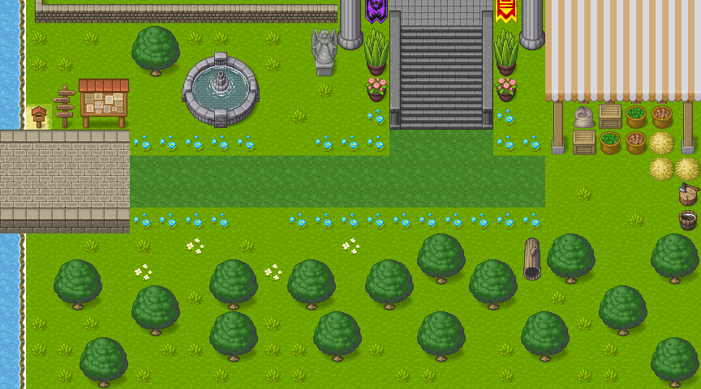

# GDD - Game Design Document - Módulo 1 - Inteli

## :dizzy: COMETA

#### Nomes dos integrantes do grupo

- <a href="https://www.linkedin.com/in/bernardo-meirelles-117243241/">Bernardo de Figueiredo Meirelles</a>
- <a href="https://www.linkedin.com/in/bruno-jancso-fabiani-0272532b3/">Bruno Jancsó Fabiani</a>
- <a href="https://www.linkedin.com/in/isadora-gatto-0900a9283?utm_source=share&utm_campaign=share_via&utm_content=profile&utm_medium=ios_app">Isadora Tribst Gatto</a>
- <a href="https://www.linkedin.com/in/marcoruas/">Marco Ruas Sales Peixoto</a>
- <a href="">Rafael Rocha Barbosa</a>
- <a href="https://www.linkedin.com/in/tainacortez/">Tainá de Paiva Cortez</a>
- <a href="https://www.linkedin.com/in/wildis-filho">Wildisley José de Souza Filho</a>

## Sumário

[1. Introdução](#c1)

[2. Visão Geral do Jogo](#c2)

[3. Game Design](#c3)

[4. Desenvolvimento do jogo](#c4)

[5. Casos de Teste](#c5)

[6. Conclusões e trabalhos futuros](#c6)

[7. Referências](#c7)

[Anexos](#c8)

<br>

# <a name="c1"></a>1. Introdução

## 1.1. Escopo do Projeto

### 1.1.1. Contexto da indústria

**5 Forças de Porter**

Desenvolvido pelo professor da Harvard Business School Michael Porter, o Modelo das Cinco Forças de Porter é um modelo de análise da competitividade de um setor industrial que permite o planejamento estratégico de empresas ao dar um panorama geral desse setor [[1]](#7-referências).

Ele considera cinco elementos-chave: a rivalidade entre empresas do mesmo segmento, o poder de barganha dos fornecedores e dos clientes, a ameaça de produtos substitutos e a possibilidade de entrada de novos concorrentes. Esses fatores influenciam a dinâmica competitiva do setor, afetando aspectos como a disputa por clientes, preços, qualidade dos produtos e lucratividade das empresas. Tais interações podem ser observadas na Figura 1.

<div align="center">
<sub> Figura 1 - As Cinco Forças de Porter</sub> <br>
	

	
<sup>Fonte: User:Arnaldo Rabelo at pt.wikipedia - Transferido de pt.wikipedia para a wiki Commons., CC BY-SA 2.0, https://commons.wikimedia.org/w/index.php?curid=2417342</sup>
</div>
<br>

Nesse sentido, desenvolvemos uma análise de setor no qual a [Meta](https://about.meta.com/br/), parceira do projeto, se encontra (Figura 2).

<div align="center">
<sub> Figura 2 - Análise 5 Forças de Porter </sub> <br>
	

	
<sup>Fonte: Material produzido pelos autores, 2024</sup>
</div>

Ademais, cabe ressaltar outros fatores determinantes no contexto da Meta no mercado, separados e listado a seguir:

**Concorrências da Meta**

- [Roblox](https://en.help.roblox.com/hc/en-us/articles/203313370-Roblox-Company-Information): uma empresa que simula mundos virtuais permitindo que seus jogadores criem seu próprio mundo. Com uma ideia semelhante, a Meta possuiu o metaverso, espaço no ambiente virtual, onde é possível estudar, trabalhar e ter uma vida social através de seus avatares.

  - No segundo trimestre de 2021, o número de usuários no Roblox foi de 43,2 milhões, apresentando um crescimento de 29% em relação ao último ano - mostrando assim a potência do RBLX com seus concorrentes.

- [TikTok](https://www.tiktok.com/about): o aplicativo de vídeos curtos apresentou um aumento de 43% no número de usuários em 2023. A maioria dos usuários prefere o TikTok em comparação ao reels (uma cópia dos vídeos de curta metragem do tiktok), apesar de haverem mais usuários de produtos Meta em um contexto global.

  - Segundo a Forbes Brasil, a escolha de criadores de conteúdo está no tiktok, com 56,7% da preferência. Em segundo lugar está o Instagram com 36,6%. Por mais que o Instagram ainda seja mais usado que o tiktok, essa plataforma se tornou um concorrente notável já que seu crescimento é muito rápido com avanço de 210% de 2021 para 2022 tornando-se a marca com o crescimento mais rápido.

- [Apple](https://www.apple.com/br/): Em relação a redes sociais, Apple e Meta competem entre melhor comunicação online e compartilhamento de conteúdo, com iMessage e Whatsapp. Países como China, Síria, Irã e Etiópia não usam o whatsapp por estarem banidos de seus países. Além disso, Apple e Meta competem entre suas tecnologias de realidade aumentada e realidade virtual, a Apple com o Vison Pro e a Meta com o Meta Quest 3.

- [X (Twitter)](https://twitter.com/): A Meta lançou uma nova rede social (Threads) que deve competir com o X (antigo Twitter). Esse novo aplicativo é baseado em conversas no formato de texto que reúnem pessoas para discutir sobre vários temas. Segundo a Folha de São Paulo, Mark Zuckerberg pretende ser o maior rival do Twitter, influenciando usuários do Twitter a usar sua nova rede social.

- [Snapchat](https://snap.com/pt-BR): Em 2016, com o lançamento dos Stories no Instagram, o Snapchat passou a ser um concorrente da Meta, visto que o Snapchat possuía uma ferramenta muito semelhante, a “Minha História”, na qual os usuários podiam publicar vídeos ou fotos com duração de 24 horas.

- [Amazon](https://www.aboutamazon.com.br/quem-somos): Amazon e Meta têm uma disputa indireta pelo envolvimento do consumidor com suas tecnologias, visto que a Amazon possui seu assistente virtual, a Alexa, e a Meta o Meta Quest. Ambas as empresas também possuem seu serviço de nuvem, Amazon com seus Webservices (AWS), que a torna uma das principais provedoras de serviços em nuvem, enquanto a Meta fornece serviços de nuvem (WhatsApp CloudAP) em menor escala.

- [Google](https://about.google/intl/ALL_br/): Grande concorrente em termos de publicidade, além de possuir a plataforma social Youtube, que compete com as redes sociais da Meta. O YouTube possui 138 milhões de usuários enquanto o Instagram tem cerca de 122 milhões.

**Tendências**

- Vídeos curtos como o Reels no Instagram.

- Advocacia ativa (posicionamento em relação à política e aos direitos humanos). Essa tendência traz aumento da participação e engajamento do público em causas sociais, através de canais para manifestar sua opinião, apoiar protestos, entre outros. Para empresas, é importante que participem para que tenham uma comunicação de marketing alinhada com o público.

- A Meta desenvolve práticas em realidade aumentada e virtual, com produtos como os óculos Meta Quest.

- O Metaverso tornou-se a criação mais desejada pela Meta. Com seu ambiente virtual, é possível criar avatares, conversar com pessoas e jogar, isso pode ser especialmente útil para usuários que estão fisicamente longe, além de revolucionar a forma com que as pessoas se comunicam e interagem.

- Comércio/compras online tem crescido muito no universo de serviços da Meta, a ideia é cada vez mais expandir o poder de compra dos usuários diretamente através das plataformas de rede social, como por exemplo as lojas de roupa no Instagram, que podem alcançar mais clientes e interagir com eles pela própria plataforma (usando, por exemplo, o “Direct” do Instagram).

**Modelo de negócios, visão de mercado**

- **Segmentação de mercado:**

  - A Meta desenvolve aplicações de mídias sociais através de dois segmentos, Família de Aplicações (FoA) e Laboratórios de Realidade (RL). Fazem parte do FoA o Instagram, Whatsapp, Facebook, entre outros, já a RL consiste em hardware, software realidade aumentada e virtual.

- **Proposta de valor:**

  - Produtos e Serviços: A Meta trabalha com diversos serviços, segundo a própria empresa os seus produtos variam entre redes sociais(Instagram, Whatsapp, Facebook), dispositivos da marca Meta Portal, Meta Spark, Lojas, Apps NPE Team, Audience Network da Meta, ferramentas de negócios.

  - Criadores de ganho: O cliente da Meta se mantém sempre atualizado em relação ao mundo devido a sua alta gama de conexão dentro das suas redes sociais e também ganha experiências incríveis através da realidade aumentada

  - Aliviam as dores: A comunicação é a chave no mundo moderno, e é expandindo-a que a Meta ajuda a aliviar as dores da sociedade, já que a falta de comunicação social é algo que a empresa ajuda a resolver

**Fontes de receita:**

- O principal método de ganho da Meta são os espaços de propaganda vendidos em suas redes sociais, além de seus produtos de realidade aumentada.

**Visão de diversidade:**

- A Meta busca empresas diversificadas, procurando parceiras que são inclusivas e socialmente responsáveis, um exemplo disso é que é importante que sua colaboradora tenha pelo menos 51% da empresa formada por pessoas que compõem grupos excluídos da sociedade(mulheres, negros, LGBTQIA+). Além disso, a Meta evita parcerias com empresas com algum tipo de envolvimento com questões como trabalho análogo a escravidão ou outras questões em que há a infração de direitos fundamentais e regulações internacionais.

### 1.1.2. Análise SWOT

A análise SWOT é uma ferramenta de gestão, desenvolvida pelo consultor americano Albert S. Humphrey, que se baseia no estudo das forças, fraquezas, oportunidades e ameaças a uma situação ou empresa, produto, indústria ou até uma pessoa [[2]](#7-referências). Cruzando características, divididas em positivas ou negativas, e origem, em internas ou externas, a matriz SWOT gera quatro diferentes fatores: _Strengths_ (forças), _Weakness_ (fraquezas), _Opportunities_ (oportunidades) e _Threats_ (ameaças).

Assim, foi desenvolvida uma análise SWOT da empresa Meta (Figura 3).

Nossa análise SWOT do parceiro:

 <div align = "center">
    
<sub> Figura 3 - Matriz SWOT</sub>


<sup>Fonte: Material produzido pelos autores, 2024</sup>

</div>

**Strengths (Forças):**

- Sendo uma das maiores plataformas de mídias sociais, a empresa possui mais de 2,8 bilhões de usuários ativos, dando-lhe um alcance enorme.

- A Meta tem grande acesso de dados dos seus usuários, os quais podem ser aproveitados para melhorar seus produtos e serviços.

- É uma empresa consolidada no mercado, tendo a reputação de atrair os melhores talentos e investir no desenvolvimento de funcionários.

- Os algoritmos da Meta estão entre os mais avançados no setor da tecnologia, o que permite o direcionamento de anúncios e proporciona experiências de usuário altamente personalizadas.

- A meta possui diversos fluxos de receita, incluindo publicidade e realidade virtual. Essa diversificação protege a empresa de qualquer fonte de receita única.

**Weaknesses (Fraqueza):**

- A Meta enfrentou muitas críticas da mídia e do governo americano em relação a sua política de privacidade.

- Dificuldade de controlar e limitar a propagação de informações erradas e notícias falsas.

- Como a empresa depende do envolvimento dos usuários, ela usa táticas para manter esses usuários conectados na plataforma por longos períodos, o que gera preocupação com a saúde mental do público.

- Envolvimento da empresa em escândalos, o que pode afetar sua reputação e a visão do público quanto a sua confiabilidade.

**Opportunities (Oportunidades):**

- Expansão da Realidade Virtual e Aumentada (VR/AR): A Meta tem enormes investimentos em tecnologias de VR/AR com o Oculus Rift e o Oculus Quest. O cenário global atual oferece oportunidades para expandir essas tecnologias além do entretenimento, incluindo aplicativos para educação, treinamento corporativo, colaboração remota e saúde.

<div align = "center">
    
<sub> Figura 4 - Óculos de realidade virtual </sub>


<sup>Fonte: Página do Angus Stevens no LinkedIn<sup>[3](#c7)</sup>, 2023</sup>

</div>

- Integração de Comércio Eletrônico: Com o crescimento contínuo do comércio eletrônico globalmente, a Meta pode explorar oportunidades para integrar mais recursos de compra e venda diretamente em suas plataformas, oferecendo aos usuários uma experiência de compra mais fluida o que acaba, consequentemente, aumentando sua receita por meio de comissões e publicidade.

- Monetização de Conteúdo: A empresa pode continuar explorando diferentes maneiras de monetizar o conteúdo gerado por usuários em suas plataformas, incluindo modelos de assinatura, publicidade direcionada e transações de conteúdo premium.

- Inovação em Inteligência Artificial e Aprendizado de Máquina: A Meta pode continuar investindo em pesquisa e desenvolvimento em IA e aprendizado de máquina para melhorar a relevância do conteúdo, personalizar experiências do usuário e fornecer ferramentas mais poderosas para os criadores de conteúdo.

- Privacidade e Segurança de Dados: Com as preocupações crescentes com privacidade e segurança de dados, a Meta pode aproveitar a oportunidade para liderar o desenvolvimento de novas tecnologias e práticas que protejam melhor os dados dos usuários e promovam a confiança em suas plataformas.

**Threats (Ameaças):**

- Concorrência:  Com a crescente do TikTok, o Instagram perde a exclusividade e se torna um ponto de ameaça.

  - Manobra feita: Criação do reels.

### 1.1.3. Descrição da Solução Desenvolvida

Nosso parceiro enfrenta um desafio no treinamento de colaboradores sobre o processo de contratação de fornecedores, derivado da falta de uma ferramenta completa que englobe todas as fases do processo, desde a seleção até o pagamento. Para superar essa questão, propomos a criação de um jogo virtual que apoiará colaboradores durante seu treinamento.

Com essa abordagem, buscamos incentivar maior participação e interação dos colaboradores no seu processo de treinamento, utilizando elementos divertidos e desafios para tornar a experiência mais envolvente. Objetivamos que nosso produto seja, além de educativo, um facilitador na entendimento de um processo complexo, assegurando que todos os envolvidos tenham uma compreensão clara e possam tomar decisões bem fundamentadas de maneira eficaz.

### 1.1.4. Proposta de Valor

O Value Proposition Canvas, ou canvas de proposta de valor, é uma ferramenta de análise de público consumidor, que ajuda as suas entender dores, necessidades e desejos, relacionando essas questões com a solução proposta [[4]](#7-referências). Essa metodologia baseia a tomada de decisões nos mais diversos níveis e também dá suporte a lançamentos.

A empresa necessita de um jogo que ajude seus colaboradores a entender o processo de contratação de fornecedores, para isso, montamos um canvas de valor com os benefícios do projeto para a Meta e para seus funcionários, além de pensar nos problemas que estão sendo resolvidos e o impacto dessa solução no contexto da empresa (Figura 5).

Um canva de valor avalia o problema a ser resolvido, como fazer isso, as dores do cliente, como aliviar essas dores, e também avaliar o que a empresa e os clientes tem a ganhar com isso.

<div align = "center">
    
<sub> Figura 5 - Canvas de Valor</sub>


<sup>Fonte: Conteúdo produzido pelos autores, modelo disponível em <https://www.strategyzer.com/library/the-value-proposition-canvas>, 2024 </sup>

</div>

### 1.1.5. Matriz de Riscos

A matriz de risco é uma ferramenta utilizada em projetos que relaciona a probabilidade de um evento acontecer e quais seriam seus impactos (consequências) [[5]](#7-referências). É importante levar em conta a Matriz de Risco no desenvolvimento de um jogo ao se planejar a entrega, antecipando eventuais problemas, como a ocorrência de bugs, ou melhorias solicitadas pelo usuário. Assim, essas questões se tornam parte do planejamento, evitando atrasos na entrega ou na qualidade do produto.

Com isso, foram elaboradas duas matrizes, identificando riscos negativos ao projeto (Figura 6).

<div align = "center">
    
<sub> Figura 6 - Matriz de Risco </sub>


<sup>Fonte: Material produzido pelos autores, 2024</sup>

</div>
Baseados na matriz de risco supracitada, elaborou-se um quadro com planos de ação para os riscos apresentados (Quadro 1).<br>

<div align="center">
<sub> Quadro 1 - Quadro de gerenciamento de riscos</sub>
</div>

|           Risco                                                                 |     Plano de Ação                                                                                                |     Responsáveis       |
| ------------------------------------------------------------------------------- | ---------------------------------------------------------------------------------------------------------------- | ---------------------- |
| Falta de informação relacionado ao processo de  contratação. (4)                | Pesquisar e entender a fundo o processo + trazer perguntas para a Thaís.                                         | Wildisley              |
| Alguém faltar na hora da apresentação. (4)                                      | Outros integrantes estarem prontos para substituir a pessoa ausente.                                             | Bernardo               |
| Ter problemas técnicos durante a apresentação. (6)                              | Trazer drive com slides com slides + ter slides em outro computador.                                             | Bruno                  |
| Imprevistos com integrantes: doença ou atividade de grupos ou clubes. (8)       | Reorganização de esforços e prazos + cada integrante priorizar o projeto.                                        | Tainá                  |
| conflito entre ideias diferentes levando ao atraso do projeto. (12)             | Votação entre os membros, não perder muito tempo com os conflitos e entrar em um acordo.                         | Scrum Master da semana |
| Bugs no código ou jogo. (10)                                                    | Fazer casos de teste constantemente e corrigir erros apontados.                                                  | Marco                  |
| Não entender ou ter dificuldades com programação, seja pelo java ou phaser. (8) | Procurar ajuda do prof ou outros membros da equipe.                                                              | Rafael                 |
| Falta de comunicação entre os membros. (16)                                     | Reuniões constantes para analisar o progresso de cada um, de modo que, todos saibam o que o outro está fazendo.  | Isadora                |
| Atraso na entrega do Backlog, subestimar tempo do projeto. (32)                 | Organização de prazos (Daily) + antecipar cronograma.                                                            | Scrum Master da semana |
| Ter que fazer alterações no jogo para atender as vontades do cliente. (40)      | Compreender a visão do cliente para atender às suas expectativas.                                                | todos os membros       |
| Perder arquivos importantes. (8)                                                | Manter as pastas organizadas para não perder os arquivos + compartilhar arquivos no grupo para que todos tenham. | todos os membros.      |

<div align="center">
<sup>Fonte: Material produzido pelos autores, 2024</sup>
</div>

Elaboramos, também, uma matriz que identifica alguma oportunidades do projeto (Figura 7)

<div align = "center">
<sub> Figura 7 - Matriz de Oportunidades </sub> </br>


</br>
<sup>Fonte: Material produzido pelos autores, 2024</sup>

</div>

## 1.2. Requisitos do Projeto

Requisitos propostos pelo parceiro e membros através de reuniões, na qual o objetivo é exibir uma série de requisitos que contemplam a mecânica, dinâmica e estética do projeto.

<div align="center">
<sub> Quadro 2 - Requisitos do projeto<sup>
</div>

| \#  | Requisito                                                                                                                        |
| --- | -------------------------------------------------------------------------------------------------------------------------------- |
| 1   | O controle do personagem será realizado usando as teclas "W", "A", "S" e "D" e pelas setas do teclado para navegação pelas fases |
| 2   | O jogo possuirá um mini tutorial instruindo o jogador como se movimentar e interagir com elementos do jogo                       |
| 3   | O jogo deve possuir uma tela de abertura para o jogador selecionar se quer jogar, ver opções ou os créditos                      |
| 4   | No jogo vai ter um npc que sempre irá atualizar o jogador com informações do objetivo                                            |
| 5   | Implementar setas do teclado no controle do personagem (atualização após sprint 3)                                               |

<div align="center">
<sup> Fonte: Material produzido pelos autores, 2024 <sup>
</div>

## 1.3. Público-alvo do Projeto

O jogo é destinado para todos colaboradores da Meta interessados em desenvolver suas habilidades e realizar contratações de fornecedores pautado no princípio da diversidade de fornecedores.

# <a name="c2"></a>2. Visão Geral do Jogo

## 2.1. Objetivos do Jogo

O objetivo do jogo é proporcionar uma simulação prática e cativante das etapas envolvidas na contratação de fornecedores para a empresa Meta. O jogador assume o papel de um novo colaborador em busca de um entendimento profundo do processo de contratação.

O jogo é estruturado em fases, cada uma correspondendo a uma etapa desse processo, permitindo que o jogador entenda o funcionamento e detalhes envolvidos em cada uma delas, finalizando o jogo com o conhecimento necessário para realizar a contratação de fornecedores de acordo com os critérios estabelecidos pela Meta.

## 2.2. Características do Jogo

### 2.2.1. Gênero do Jogo

Nosso jogo será estilo _RPG Top Down_ no qual o jogador tem o seu personagem, o Tyler, um colaborador recém-contratado da Meta que procura entender melhor o processo de contratação da empresa. Neste jogo, há uma fase para representar cada etapa do processo de contratação. O andamento do jogo se dá por meio da alternância entre momentos de narração e _minigames_, nos quais o jogador terá que atingir todos os requisitos para conseguir avançar de fase e, por fim, chegar ao fim do jogo.

Tomamos como inspiração alguns jogos como Pokémon, principalmente [Pokémon FireRed](https://www.nintendo.pt/Jogos/Game-Boy-Advance/Pokemon-FireRed-267123.html) e [Pokémon Ruby](https://www.nintendo.pt/Jogos/Game-Boy-Advance/Pokemon-Ruby-267167.html), e no jogo [The Legend of Zelda: The Minish Cap](https://www.nintendo.pt/Jogos/Game-Boy-Advance/The-Legend-of-Zelda-The-Minish-Cap-267486.html), todos da [Nintendo](https://www.nintendo.pt/).

### 2.2.2. Plataforma do Jogo

- Quanto ao dispositivo: desktops e smartphones.

- Quanto ao sistema: ambiente web.

### 2.2.3. Número de jogadores

O jogo foi pensado e desenvolvido para apenas um jogador.

### 2.2.4. Títulos semelhantes e inspirações

Como citado no item 2.2.1, tivemos diversas inspirações durante o desenvolvimento. Quanto ao estilo, um _rpg top down_, tomamos como base jogos da franquia Pokémon, principalmente [Pokémon FireRed](https://www.nintendo.pt/Jogos/Game-Boy-Advance/Pokemon-FireRed-267123.html) e [Pokémon Ruby](https://www.nintendo.pt/Jogos/Game-Boy-Advance/Pokemon-Ruby-267167.html), e no jogo [The Legend of Zelda: The Minish Cap](https://www.nintendo.pt/Jogos/Game-Boy-Advance/The-Legend-of-Zelda-The-Minish-Cap-267486.html), todos da [Nintendo](https://www.nintendo.pt/).

Também temos um design baseado na [Twilight Forest](https://www.curseforge.com/minecraft/mc-mods/the-twilight-forest), uma modificação do jogo [Minecraft](https://www.minecraft.net/pt-br) que mistura diversos elementos fantásticos, como fadas e castelos, porém apresentando-os com uma estética mais misteriosa e sombria.

### 2.2.5. Tempo estimado de jogo

O jogo pode ser concluído em até 25 minutos. O tempo final do jogo depende do jogador, visto que, só é possível avançar no jogo completando as fases corretamente, tendo de repeti-las em outro caso.

# <a name="c3"></a>3. Game Design

## 3.1. Enredo do Jogo

Tyler, o protagonista do jogo, é um novo colaborador da Meta. Como novo colaborador, ele precisa passar pelo treinamento que vai capacitá-lo a contratar fornecedores "aos moldes Meta de contratação". Nesse processo de treinamento, Tyler irá receber a ajuda da Vanessa, uma colaboradora do time de _Diversity Supply_ que testará, juntamente com a Equipe de Inovação, um novo treinamento que se utiliza de tecnologias de realidade virtual para ensinar todo o processo de contratação de fornecedores em um mundo fictício dentro do _metaverso_.

Assim, Tyler embarca em uma aventura em um universo fantástico com a missão de ajudar um rei a preparar um festival para divulgar o resultado de anos de pesquisa e desenvolvimento do reino. Para isso, o jogador terá que realizar a contratação de fornecedores de elementos para a festa, como comida, decoração entre outros. Aqui, o reino e o próprio rei são uma metáfora a Meta, com o reino possuindo os valores da empresa e seguindo um processo de contratação de fornecedores muito semelhante ao da Meta.

## 3.2. Personagens

### 3.2.1. Controláveis

Em nosso jogo existe apenas um personagem controlado pelo jogador, o Tyler. Ele representa um novo colaborador da Meta e sua missão é compreender plenamente o processo de contratação de fornecedores, buscando sempre fazer escolhas que respeitem o princípio da diversidade, muito presente na empresa. Visando fortalecer a rede de fornecedores de forma inclusiva, Tyler enfrenta desafios que exigem discernimento e sensibilidade cultural, em que suas escolhas influenciam não apenas o sucesso da empresa, mas também seu compromisso com a promoção e valorização da diversidade de fornecedores e justiça social.

Dessa maneira, tem-se o design do protagonista no mundo real (Figura 8) e sua versão dentro do metaverso (Figura 9)

<div align = "center">

<sub> Figura 8 - Tyler</sub>


<sup>Fonte: Material produzido pelos autores, 2024</sup>

</div>

<div align = "center">

<sub> Figura 9 - Tyler com armadura</sub>


<sup>Fonte: Material produzido pelos autores, 2024</sup>

</div>

### 3.2.2. Non-Playable Characters (NPC)

Como mencionado no item 3.2.1, a diversidade de fornecedores é essencial para empresa Meta. Desse modo, buscamos desenvolver _NPCs_ que representem essa diversidade e inclusão, a fim de promover a igualdade de oportunidades. Cada um desses _NPCs_ traz consigo características e experiências únicas, são eles:

Celeste: Uma Elfa com traços afrodescendente que representa a população feminina e negra.

<div align = "center">

<sub> Figura 10 - Celeste</sub>


<sup>Fonte: Material produzido pelos autores, 2024</sup>

</div>

Aysla: Uma druida portadora de albinismo, representando a diversidade em suas múltiplas formas.

<div align = "center">

<sub> Figura 11 - Aysla</sub>


<sup>Fonte: Material produzido pelos autores, 2024</sup>

</div>
Romeo: Um mago com deficiência visual, cuja presença destaca a importância da inclusão de pessoas com deficiência.
<div align = "center">

<sub> Figura 12 - Romeo</sub>


<sup>Fonte: Material produzido pelos autores, 2024</sup>

</div>

Gizmo: Um arqueiro com deficiência física, cuja habilidade e determinação desafiam qualquer tipo de estereótipo.

<div align = "center">

<sub> Figura 13 - Gizmo</sub>


<sup>Fonte: Material produzido pelos autores, 2024</sup>

</div>

Vanessa: Uma mulher em posição de destaque na empresa, um símbolo de progresso e igualdade de gênero. Seu papel no jogo é mostrar que as mulheres podem ocupar cargos de liderança com excelência.

<div align = "center">

<sub> Figura 14 - Vanessa</sub>


<sup>Fonte: Material produzido pelos autores, 2024</sup>

</div>

Rei: Um monarca com traços afrodescendente, ele ocupa o mais alto escalão da realeza, desafiando estereótipos enraizados sobre a predominância da pele branca na monarquia.

<div align = "center">

<sub> Figura 15 - Rei</sub>


<sup>Fonte: Material produzido pelos autores, 2024</sup>

</div>

### 3.2.3. Diversidade e Representatividade dos Personagens

Dentro o nosso jogo, temos como representação de fornecedores personagens com características diversas, como:

- **Celeste**: uma elfa com traços afrodescendentes, representando a população feminina e preta. A personagem também se constitui de um símbolo de poder e pureza através de uma posição celestial e espirituosa, possuindo uma posição de destaque no contexto do jogo. Assim, procura-se desassociar qualquer pensamento preconceituoso e obsoleto referente a pessoas de pele preta e a sua posição dentro da sociedade.

- **Aysla**: uma druida amante da fauna e da flora e que tem uma condição de ausência de melanina. Por meio dessa personagem, também almejamos trazer aspectos da responsabilidade ambiental e cuidado com os recursos naturais.

- **Romeo**: um mago com deficiência visual. Ele é capaz de se orientar através do som do ambiente e da leitura de energias. Nosso objetivo com esse general (fornecedor) é muito semelhante ao objetivo que temos com o Gizmo: mostrar que pessoas com deficiência são plenamente capazes de desempenhar suas funções.

- **Gizmo**: personagem que utiliza uma prótese na sua perna esquerda. Através dele buscamos mostrar que, independente de qualquer condição física, pessoas com deficiência são capazes de desempenhar suas funções com excelência. </br>

## 3.3. Mundo do jogo

### 3.3.1. Locações Principais e/ou Mapas

Este é o mapa inicial (Figura 16), uma avenida onde está o escritório da Meta. Como primeiro mapa do jogo, espera-se que aqui o jogador aprenda os comandos de movimentação do personagem enquanto segue para o interior do edifício da Meta.

<div align = "center">

<sub> Figura 16 - Mapa Inicial</sub>


<sup>Fonte: Material produzido pelos autores, 2024</sup>

</div>

Por sua vez, tem-se aqui (Figura 17) a sala na qual o protagonista deverá usar o _Meta Quest_ e entrar no Metaverso.

<div align = "center">

<sub> Figura 17 - Escritório</sub>


<sup>Fonte: Material produzido pelos autores, 2024</sup>

</div>

Neste momento, observa-se uma parcela do mapa referente ao Metaverso: uma floresta onde o Tyler iniciará sua aventura nesse novo mundo (Figura 18).

<div align = "center">

<sub> Figura 18 - Floresta</sub>


<sup>Fonte: Material produzido pelos autores, 2024</sup>

</div>
    
Além disso, há também um cenário que representa o interior do castelo do rei. Aqui, o Tyler deve se locomover até o salão real (Figura 19), onde o rei o aguarda (Figura 20).

<div align = "center">

<sub> Figura 19 - Corredor do castelo</sub>


<sup>Fonte: Material produzido pelos autores, 2024</sup>

</div>

<div align = "center">

<sub> Figura 20 - Sala do rei</sub>


<sup>Fonte: Material produzido pelos autores, 2024</sup>

</div>

### 3.3.2. Navegação pelo mundo

**1. Configurações Iniciais:**

   - Na tela inicial, o jogador seleciona o idioma desejado (inglês ou português). Em seguida, encontra a opção "Play" para iniciar efetivamente o jogo.

**2. Controles do Personagem:**

   - Utilizando os seguintes controles:
     - W ou &uarr;: Movimento para cima
     - S ou &darr;: Movimento para baixo
     - A ou &larr;: Movimento para a esquerda
     - D ou &rarr;: Movimento para a direita

**3. Segunda Cena: Rua**

   - Ao clicar em " Play", o personagem controlável, Tyler, é posicionado para a segunda cena, localizada na rua em frente ao prédio da Meta. O jogador utiliza os controles para guiar Tyler até a empresa Meta, situada no canto direito da tela.

**4. Terceira Cena: Interior da Meta**

   - Ao deslocar-se até a porta do prédio da Meta, o personagem é enviado para a terceira cena. Nesta cena, Tyler encontra Vanessa, que fornece as devidas instruções e o encaminha para os óculos de realidade virtual, os quais o levarão para o metaverso (onde ocorre a quarta cena).

**5. Quarta Cena: Floresta (Metaverso):**

   - Ao concluir a terceira cena, o jogador é enviado para uma floresta, onde Tyler encontra um _NPC_ que oferece orientações sobre a jornada e o direciona para a próxima cena.

**6. Quinta cena: Transição entre Floresta e Castelo:**

- Ao atravessar uma ponte no final da floresta, Tyler entra na quinta cena, um jardim em frente ao castelo. Um novo _NPC_ orientador direciona Tyler ao _Castelo do Rei_.

**7. Sexta cena: Castelo**

   - Ao adentrar o castelo, Tyler é inserido na sexta cena, situada no corredor que o conduz até a _Sala do Rei_.

**8. Sétima cena: Sala do Rei**

- Na sétima cena, localizada na sala do trono do rei, Tyler recebe instruções acerca da continuidade e história do jogo.

**9. Próximos Passos em Desenvolvimento:**

   - Correção de _bugs_ nos mapas do jogo;
   - Criação do _Sala da Escriba_, cenário no qual ocorrerão alguns dos _minigames_;
   - Melhora na usabilidade e no ensino sobre as mecânicas de movimentação do persongem para o jogador;
   - Ajuste dos diálogos;

### 3.3.3. Condições climáticas e temporais

Nosso jogo conta com uma de passagem de tempo, onde a tela escurece e clarea para indicar que se passaram alguns dias.

### 3.3.4. Concept Art

_Concept Art_, "Arte conceitual" em tradução livre, diz respeito a uma série de ilustrações, desenhos, rascunhos ou outras formas de arte que tem como objetivo ilustrar a ideia de algum elemento de uma obra, como o design de um personagem, objeto, cenário, criatura etc.[[6]](#7-referências) [[7]](#7-referências)

Nesse sentido, foram desenvolvidas _concept arts_ para que pudéssemos visualizar algumas de nossas ideias de personagens, _minigames_ e cenários. Essas ilustrações conceituais foram feitas de diversas formas, desde desenhos feitos à mão (Figuras 21 e 22) até ilustrações digitais (Figura 23).

<div align = "center">
<sub> Figura 21: Concept art da Sala do Trono</sub>


<sup>Fonte: Material produzido pelos autores, 2024</sup>

</div>

<div align = "center">
<sub> Figura 22 - Concept art do _minigame_ 1 </sub> <br>


<sup>Fonte: Material produzido pelos autores, 2024</sup>

</div>

<div align = "center">

<sub> Figura 23 - Concept art do pergaminho de perfis do minigame 2</sub>

 <br>

<sup>Fonte: Material produzido pelos autores, 2024</sup>

</div>

### 3.3.5. Trilha sonora

A trilha sonora e sonoplastia do jogo foi feita através de áudios disponibilizados no banco de mídia [Pixabay](https://pixabay.com/pt/). Todos os áudios podem ser utilizados para qualquer fim sem a necessidade de referenciação ou citação do autor.O objetivo da trilha sonora aumentar a imersão do jogador no jogo, criando uma nova camada sonora que complementa os elementos visuais. Para além da trilha sonora, também foram outros sons (como sons de passos, pássaros e portas) para contribuir com o realismo e verosimilhança da cena.

<div align="center">
<sub> Quadro 3 - Trilha sonora do projeto<sub>
</div>
<div align= "center">

| \#  | titulo                | ocorrência                                     | autoria                                                                                       |
| --- | --------------------- | ---------------------------------------------- | --------------------------------------------------------------------------------------------- |
| 1   | Passos no Concreto    | Personagem andando no chão de concreto         | [Pixabay](https://pixabay.com/pt/sound-effects/concrete-footsteps-6752/)                      |
| 2   | Passos na grama       | Personagem andando na terra                    | [Pixabay](https://pixabay.com/pt/sound-effects/going-on-a-forest-road-gravel-and-grass-6404/) |
| 3   | Sons da rua           | Cena em frente ao prédio                       | [Pixabay](https://pixabay.com/pt/sound-effects/city-sounds-23969/)                           |
| 4   | Sons da Floresta      | Cena da floresta                               | [SSPsurvival](https://pixabay.com/pt/sound-effects/the-voices-of-birds-in-the-forest-7715/)   |
| 5   | Som do Riacho         | Cena da floresta, próximo ao córrego           | [Pixabay](https://pixabay.com/pt/sound-effects/rapid-wide-mountain-river-59594/)              |
| 6   | Som do Banner         | Corredor do castelo, ao interagir com o banner | [Pixabay](https://pixabay.com/pt/sound-effects/cloth-100503/)                                 |
| 7   | Som do Piano          | Sala do Trono, ao interagir com o piano        | [Pixabay](https://pixabay.com/pt/sound-effects/piano-g-6200/)                                 |
| 8   | Folha Passando        | Minigame 1, ao passar uma ficha                | [Floraphonic](https://pixabay.com/pt/sound-effects/book-foley-turn-pages-2-189809/)           |
| 9   | Entrando no metaverso | Transição de cena, ao entrar no metaverso      | [aiko_Changing](https://pixabay.com/pt/sound-effects/transition-futuristic-ufo-121421/)       |
| 10  | Passagem do tempo | Transição de cena que representa passagem de tempo | [SSPsurvival](https://pixabay.com/pt/sound-effects/clock-clock-sound-clock-clock-time-10343/ )       |

</div>

<div align="center">
<sup> Fonte: Material produzido pelos autores, 2024 <sup>
</div>

## 3.4. Inventário e Bestiário

### 3.4.1. Inventário

Não há intens especiais ou inventário em nosso jogo.

### 3.4.2. Bestiário

Não há inimigos em nosso jogo.

## 3.5. Gameflow (Diagrama de cenas)

O "Diagrama de cenas", ou _Gameflow_, é um documento que ilustra como as diferentes cenas presentes em um jogo estão relacionadas entre si, indicando o modo como elementos dentro da cena podem desencadear reações relacionadas a mudança de estados ou mesmo da mudança de cena. Assim, o diagrama de cenas é capaz de apresentar uma sequência lógica de acontecimentos dentro do jogo, o que facilita o processo de desenvolvimento deste.[[8]](#7-referências)

Nesse sentido, foi desenvolvido um diagrama de cenas que relaciona as duas cenas iniciais do nosso jogo (Figura 24) usando a ferramenta [Figma](https://www.figma.com/), e, posteriormente, um esquema que englobasse todo o jogo, disponível no [Anexo A](#anexos) ou abaixo:

[Gameflow (diagrama de cenas)](<https://www.figma.com/file/pAGJO8K0EiS1LBVF8aQPS8/Storyboard-de-programa%C3%A7%C3%A3o-(Diagrama-de-cenas)?type=whiteboard&t=596Q4PORtJdAKPrV-1>)

<div align = "center">

<sub> figura 24 - Diagrama de cenas</sub>


<sup>Fonte: Material produzido pelos autores, 2024</sup>

</div>

## 3.6. Regras do jogo

O objetivo principal do jogador é entrar em uma jornada para compreender o processo de contratação da Meta, guiado por etapas estruturadas no jogo. No decorrer das etapas, o rei assume o papel de instrutor e passa informações importantes sobre o processo de contratação, além de direcionar Tyler para _minigames_ que precisam ser realizados corretamente para que o jogo continue.

**Etapa 1:**

**_Minigame_ 1:**

Ocorre após as instruções iniciais do rei. Nesse _minigame_, são apresentadas diversas perguntas, sendo algumas pertinentes para serem feitas aos potenciais fornecedores e outras não. A tarefa do jogador consiste em selecionar as perguntas corretas para avançar à próxima fase. Caso seja escolhida alguma pergunta errada, o rei oferece uma dica para orientar a Tyler, possibilitando que o jogador tente novamente.

**_Minigame_ 2:**

Ocorre após o _Minigame_ 1. Nesse momento, Tyler deve analisar pergaminhos enviado pelos generais que contém informações sobre os seus exércitos, como características dos guerreiros, últimas atividades desse exército e dados sobre os próprios líderes dessas tropas. O objetivo é que o jogador escolha, baseado na premissa da _Diversidade de Fornecedores_, exércitos (metáfora para os fornecedores dentro da história) mais adequados para concluir o jogo. Em caso de erros, o rei oferecerá dicas para que o jogador tente novamente até fazer as escolhas corretas.

**Etapa 2:**

Tyler deve entregar suas respostas no _Minigame_ 2 ao rei, permitindo que este avalie e emite sua análise sobre as escolhas do jogador. Esta fase faz referência a validação pela qual os fornecedores passam antes de serem cadastrados nos sistemas da Meta.

**Etapas seguintes:**

 Nas etapas restantes, o rei explica em detalhes o que ocorre em cada fase do processo de contratação. Tyler também passará por mais um _minigame_, no qual ele deverá discutir as condições de trabalho dos fornecedores e acordar os valores a serem pagos a cada um deles. O jogador acompanha as explicações do rei para compreender o funcionamento de cada parte do processo de contratação da Meta. O desfecho do jogo ocorre quando o usuário conclui cada _minigame_ e supera todas as fases.

## 3.7. Mecânicas do jogo

O jogo tem um personagem principal que é movimentado através das teclas "W","A","S" e "D" e também pela setas do teclado. Ele é livre para percorrer todo o mapa, possuindo algumas barreiras que o impossibilitam de acessar certas regiões. Além das teclas de movimento, existe a tecla "E", responsável pela interação entre o personagem e alguns _NPCs_ e elementos do cenário. Ademais há a possibilidade de jogar com um _joystick_ no lugar de usar o teclado.

O jogo possui _minigames_ de escolha, nos quais o jogador deve selecionar, através de cliques, dentre as opções apresentadas na tela as que julgar corretas. No _minigame_ 1, por exemplo, existem perguntas a serem selecionadas para a formação do RFP, sendo a fase concluída após a escolha das alternativas corretas. Após isso, tem-se o _minigame_ 2, cujo objetivo é que o jogador aceite ou recuse os fornecedores com base no perfil deles, tendo a seleção feita por meio de clique no mouse. Em dispositivos móveis, o sistema de cliques com mouse é feita por meio de cliques na tela.

# <a name="c4"></a>4. Desenvolvimento do Jogo

## 4.1. Desenvolvimento preliminar do jogo

**Resumo**

Nosso personagem principal, o Tyler Calvin, inicia sua jornada em uma rua. O Tyler segue sua trilha e entra em uma nova cena, onde ele encontra a Vanessa, que vai auxiliá-lo no treinamento do processo contratação de novos fornecedores.

Para começar nosso projeto, criamos a _spritesheet_ (imagem que reúne todos os diferentes estados que um elemento pode estar, permitindo que sejam feitas rápidas alterações nesses estados de modo a gerar uma animação de movimento), de movimentação do nosso personagem. Em seguida, selecionamos duas imagens para servir de fundo e aplicamos barreiras para impedir que o personagem transpassasse os limites do mapa.

Utilizamos-nos dos conhecimentos adquiridos nas aulas de programação para e de estudos autônomos para fazer o personagem se movimentar e um modo de gerenciar múltiplas cenas.

A seguir, imagens do desenvolvimento preliminar do jogo:

<div align = "center">

<sub> Figura 25 - Cena inicial</sub>


<sup>Fonte: Material produzido pelos autores, 2024</sup>

</div>

<div align = "center">

<sub> Figura 26 - Encontro com a Vanessa</sub>


<sup>Fonte: Material produzido pelos autores, 2024</sup>

</div>

**Desafios**

Um desafio enfrentado nesse momento foi a mudança de cenas. Contudo, essa questão foi resolvida através de conteúdos disponíveis online e aulas da "Semana 4". Com isso, conseguimos implementar essa mecânica dentro do nosso primeiro protótipo.

**Próximos passos**

- Desenvolver mais personagens, sempre buscando diversidade.
- Estabelecer os estilos do jogo.
- Focar na usabilidade e portabilidade, fazendo com que o jogo possa ser utilizado pelo maior número de colaboradores possível.
- Manter um desenvolvimento próximo à Meta com o objetivo de alinhar expectativas com um processo constante de produção e feedbacks.
- Desenvolvimento completo da história e das mecânicas que vão tornar nosso jogo único.
- Criar uma trilha sonora para o jogo.

## 4.2. Desenvolvimento básico do jogo

**Resumo**

O projeto é desenvolvido em [JavaScript](https://developer.mozilla.org/en-US/docs/Web/JavaScript) com o uso do _framework_ [Phaser](https://phaser.io/), uma coleção de código já feita da qual podemos utilizar como uma "caixa de ferramentas". O uso do Phaser facilita no processo de desenvolvimento, visto que muitas funções já estão feitas, permitindo que apenas as implementemos.

Assim, nos utilizando dessas ferramentas, desenvolvemos para que nosso jogo começasse com uma tela inicial contendo alguns botões. Através de código, implementamos funções, trechos de código que podem ser reutilizados, que aumentam o tamanho dos botões quando o mouse estiver sobre eles. Por fim, o botão de play é responsável por realizar a transição para a primeira cena do jogo.

<div align = "center">
    
<sub> Figura 27 - Tela Inicial</sub>


<sup>Fonte: Material produzido pelos autores, 2024</sup>

</div>

As cenas no nosso jogo são divididas em classes, uma estrutura que armazena informações, atributos, e métodos, funções próprias que a permite executar certas ações.

Classes de cena são capazes de "chamar" outras classes secundárias, responsáveis pela movimentação de personagens, por exemplo, e as utilizarem em seus processos internos. Visto que esses códigos são utilizados diversas vezes ao longo do jogo, essas classes são armazenadas separadamente, tornando o projeto como um todo mais organizado e facilitando a reutilização e manutenção desses trechos.

A seguir, um fragmento da classe responsável pelos controles do personagem:

```javascript
export default class Controls {
	// Construtor que recebe a cena e o jogador como parâmetros
	constructor(scene, player) {
		this.scene = scene;
		this.player = player;

		// Adiciona as teclas de seta para cima, baixo, direita e esquerda ao objeto "cursor"
		this.cursor = scene.input.keyboard.addKeys({
			up: Phaser.Input.Keyboard.KeyCodes.W,
			down: Phaser.Input.Keyboard.KeyCodes.S,
			right: Phaser.Input.Keyboard.KeyCodes.D,
			left: Phaser.Input.Keyboard.KeyCodes.A,
			upSeta: Phaser.Input.Keyboard.KeyCodes.UP,
			downSeta: Phaser.Input.Keyboard.KeyCodes.DOWN,
			rightSeta: Phaser.Input.Keyboard.KeyCodes.RIGHT,
			leftSeta: Phaser.Input.Keyboard.KeyCodes.LEFT,
		});

		//Adiciona a tecla E como a tecla de interação
		this.interacao = scene.input.keyboard.addKey(
			Phaser.Input.Keyboard.KeyCodes.E
		);
	}
```

Voltando a cena inicial, o personagem começa em uma rua em frente ao prédio da Meta, e deve seguir até a porta de entrada. Lá, o Tyler terá acesso ao prédio através do teclado, já que a configuração de troca de cena acontece quando o jogador apertar a tecla "E", mecânica que se repetirá ao longo do jogo nas interações com _NPCs_ e com o cenário.

A seguir, uma parte da cena inicial:

<div align = "center">

<sub> Figura 28 - Prédio da Meta</sub>


<sup>Fonte: Material produzido pelos autores, 2024</sup>

</div>

A ideia em desenvolvimento é que o personagem encontrará a _NPC_ Vanessa dentro da Meta e ela o ajudará nessa jornada. No interior do prédio, através do editor de cenários [Tyled](https://www.mapeditor.org/), implementamos as barreiras na qual o personagem vai esbarrar, impedindo-o de atingir determinados pontos do mapa. Essas barreiras estarão por todo o jogo, não permitindo que o jogador atravesse objetos do cenário.

Após interagir com a Vanessa, Tyler é levado ao metaverso, onde grande parte do jogo se desenvolve.

A seguir, alguns cenários do metaverso:

<div align = "center">

<sub> Figura 29 - Colisão com árvores e Vanessa</sub>


<sup>Fonte: Material produzido pelos autores, 2024</sup>

</div>

<div align = "center">

<sub> Figura 30 - Interior do castelo</sub>


<sup>Fonte: Material produzido pelos autores, 2024</sup>

</div>

**Desafios**

A maior dificuldade desta _Sprint_ foi o conteúdo. Em diversos momentos queríamos implementar algo no código que ninguém do grupo sabia como, tendo sido a busca por resposta muitas vezes trabalhosa. Foi possível, entretanto, que colocássemos nossas ideias em prática por meio de pesquisas individuais.

**Próximos passos**

- Construir todas as nossas cenas de forma funcional.
- Incluir os _minigames_ que estão planejados no momento.
- Adaptar o jogo para dispositivos móveis.

## 4.3. Desenvolvimento intermediário do jogo

**Resumo**

Na Sprint 2 já havia uma ideia sólida dos objetivos que queríamos alcançar, por isso, durante a _Sprint_ 3 poucas fatores foram modificados, mas muitas elementos implementadas.

O design do castelo foi alterado com a intenção de passar a ideia de um castelo da Meta, por isso, a cor azul ganhou destaque na cena (Figura 31). Também mudamos o cenário de integração entre a floresta e o castelo, para aumentar a dinamicidade da passagem entre as cenas (Figura 32).

<div align = "center">

<sub> Figura 31 - Castelo Novo</sub>


<sup>Fonte: Material produzido pelos autores, 2024</sup>

</div>

<div align = "center">

<sub> Figura 32 - Exterior do castelo </sub>



<sup>Fonte: Material produzido pelos autores, 2024</sup>

</div>

O jogo agora conta, também, com a cena do escritório (Figura 33), no interior da Meta, onde o jogador encontrará a Vanessa e terá toda a instrução necessária para iniciar o jogo. Também temos a sala do escriba (Figura 34), um novo cenário dentro do castelo.

<div align = "center">

<sub> Figura 33 - Sala de escritório </sub>


<sup>Fonte: Material produzido pelos autores, 2024</sup>

</div>

<div align = "center">

<sub> Figura 34 - Sala do escriba </sub>


<sup>Fonte: Material produzido pelos autores, 2024</sup>

</div>

A principal alteração do nosso jogo, na questão de mecânicas, foi a implementação dos diálogos entre o Tyler e o rei (Figura 35), nos quais são explicados o processo de contratação e dois _minigames_ (Figuras 36 e 37) que vão testar se o jogador está entendendo o processo. No _minigame_ 1, o jogador deve selecionar perguntas que serão enviadas aos futuros fornecedores, já no _minigame_ 2, o usuário deve escolher, dentre vários resumos enviadas por fornecedores, os mais condizentes aos critérios apresentados.

<div align = "center">

<sub> Figura 35 - Conversa com rei </sub>


<sup>Fonte: Material produzido pelos autores, 2024</sup>

</div>

<div align = "center">

<sub> Figura 36 - Minigame 1 </sub>


<sup>Fonte: Material produzido pelos autores, 2024</sup>

</div>

<div align = "center">

<sub> Figura 37 - Minigame 2 </sub>


<sup>Fonte: Material produzido pelos autores, 2024</sup>

</div>

**Desafios**

Não passamos por desafios significativos nesta _Sprint_.

**Próximos passos**

- Implementar o idioma inglês.
- Implementar fases relativas às outras etapas do processo de contratação.

## 4.4. Desenvolvimento final do MVP

**Resumo**

Na _Sprint_ 4, nosso jogo ganhou mais interações com _NPCs_, sendo agora todo o processo de contratação explicado através de diálogos. Também foi adicionado um novo e último _minigame_, no qual ocorre a negociação de alguns termos do contrato. Além disso, alguns cenários foram melhorados, trazendo melhor aspecto visual ao jogador.

Tudo começa na tela inicial (Figura 38), na qual o usuário tem a opção de escolher o idioma quer jogar (português ou inglês).

<div align = "center">

<sub> Figura 38 - Idiomas na Tela inicial</sub>


<sup>Fonte: Material produzido pelos autores, 2024</sup>

</div>

Na primeira cena, temos uma _HUD_, ferramenta que indica algumas informações ao na tela do jogo sem fazer parte do cenário [[9]](#7-referências), que auxilia o jogador, ensinando-o como se locomover e o que deve ser feito.

<div align = "center">

<sub> Figura 39 - Tutorial básico do jogo </sub>


<sup>Fonte: Material produzido pelos autores, 2024</sup>

</div>

Anteriormente, tínhamos duas cenas para representar uma floresta e o exterior do castelo. Decidimos juntá-las e fazer uma cena mais lógica com a proposta do nosso jogo (Figura 40). Essa junção também melhora a experiência do usuário, ao tornar mais dinâmico o andamento do jogo.

<div align = "center">

<sub> Figura 40 - Novo exterior do castelo </sub>


<sup>Fonte: Material produzido pelos autores, 2024</sup>

</div>

O castelo foi dividido em duas partes, o corredor (Figura 41) e a Sala do Rei (Figura 42). O jogador atravessa o corredor, onde ele pode interagir com _NPCs_, até chegar à Sala do Rei, onde se inicia toda a aventura.

<div align = "center">

<sub> Figura 41 - Corredor do castelo </sub>


<sup>Fonte: Material produzido pelos autores, 2024</sup>

</div>

<div align = "center">

<sub> Figura 42 - Sala do rei </sub>


<sup>Fonte: Material produzido pelos autores, 2024</sup>

</div>

Também adicionamos mensagens que informam ao jogador a que etapa do processo de contratação aquele momento representa (Figura 43). Isso a abstração e assimilação dos conteúdos ao usuário.

<div align = "center">

<sub> Figura 43 - Mensagem de abertura </sub>


<sup>Fonte: Material produzido pelos autores, 2024</sup>

</div>

Na _Sprint_ 3 já tínhamos os dois primeiros _minigames_. Entretanto, a conexão entre esses minijogos e os diálogos de ajuda não haviam sido implementada.

Sendo assim, agora, após chegar no castelo, o Tyler conversa com o rei (Figura 44), que lhe explica o que ele deve fazer no início do processo de contratação, o encaminhando, em seguida, para a Sala da Escriba, que fará as ultimas instruções (Figura 45) antes do jogador iniciar o _minigame_ 1.

<div align = "center">

<sub> Figura 44 - Diálogo com o rei </sub>


<sup>Fonte: Material produzido pelos autores, 2024</sup>

</div>

<div align = "center">

<sub> Figura 45 - Diálogo com a escriba </sub>


<sup>Fonte: Material produzido pelos autores, 2024</sup>

</div>

O _minigame_ 1 (Figura 46) sofreu uma pequena alteração. Com o foco em melhorar a experiência do usuário, foi reduzido o número de perguntas, saindo de 9 para 6 delas. Além disso, foi implementado o sistema de dicas caso o jogador não escolha as perguntas mais adequadas (Figura 47).

<div align = "center">

<sub> Figura 46 - As perguntas do minigame 1 </sub>


<sup>Fonte: Material produzido pelos autores, 2024</sup>

</div>

<div align = "center">

<sub> Figura 47 - Possibilidade de melhor escolha </sub>


<sup>Fonte: Material produzido pelos autores, 2024</sup>

</div>

Com o fim do _minigame_ 1, o Tyler conversa com a escriba que indica que ele entregue as perguntas escolhidas para o rei. Depois disso, após um diálogo e uma breve passagem de tempo, Tyler vai até o rei, o qual lhe dá instruções para que ele vá ao encontro da escriba novamente, desta vez para o _minigame_ 2.

O _minigame_ 2 (Figura 48) também passou por uma pequena alteração no design, incluindo informações mais realistas dos fornecedores e um novo gráfico.

<div align = "center">

<sub> Figura 48 - Alteração no design do minigame 2</sub>


<sup>Fonte: Material produzido pelos autores, 2024</sup>

</div>

Foi, também, adicionado o _minigame_ 3 (Figura 49). Nele o Tyler terá que negociar com os 4 fornecedores quase contratados. Utilizando muito da lógica do "_If_" e "_Else_", implementamos uma árvore de possibilidades de diálogos possíveis a depender das ações do usuário.

<div align = "center">

<sub> Figura 49 - Minigame 3 </sub>


<sup>Fonte: Material produzido pelos autores, 2024</sup>

</div>

Após a negociação, haverá um diálogo com o rei, e então o tão esperado evento começa: a Meta Connect. Foi adicionada uma cena que representará o evento (Figura 50).

<div align = "center">

<sub> Figura 50 - Meta Connect </sub>


<sup>Fonte: Material produzido pelos autores, 2024</sup>

</div>

Por fim, o Tyler volta de toda essa jornada no metaverso e fala mais uma vez com a Vanessa (Figura 51). Dessa vez ela o explica o que aconteceu e o que deveria acontecer se ele continuasse nessa aventura, assim encerrando a jornada de Tyler.

<div align = "center">

<sub> Figura 51 - A volta do Tyler </sub>


<sup>Fonte: Material produzido pelos autores, 2024</sup>

</div>

**Desafios**

A lógica do _minigame_ 3 foi um desafio por devido à grande quantidade de possibilidades. O funcionamento da etapa se baseias na posição das caixas de diálogos. Dependendo da posição em que uma caixa surge, assume-se um valor que varia dependendo das escolhas do jogador. Infelizmente, isso torna o código pouco escalável, sendo difícil reproduzi-lo sem alterar os valores e funções dentro do código.

Além disso, nosso jogo possuía um _bug_ nos diálogos que ocorria quando você pressionava a tecla de interação com _NPCs_ antes do diálogo acabar de aparecer na tela. Após muitas tentativas, foi possível superar essa questão.

**Próximos passos**

- Correção de bugs
- Melhoria no designs do jogo
- Mais testes

## 4.5. Revisão do MVP

**Resumo**

Nosso jogo foi finalizado na _Sprint_ 4. Entretanto, algumas correções e melhorias precisavam ser feitas. Nesse sentido, a _Sprint_ 5 trouxe correções de bugs e melhorias visuais, sem a implementação de novos _minigames_. Também houve a adição da cena final de créditos, com o nome de cada membro da equipe.

Com a adição de uma cena de créditos no final do jogo, o botão de créditos da tela inicial não era mais necessário, por isso, atualizamos a tela inicial (Figura 52) do jogo removendo-o.

<div align = "center">

<sub> Figura 52 - Tela inicial final </sub>


<sup>Fonte: Material produzido pelos autores, 2024</sup>

</div>

Com base nos casos de teste, a cena inicial (Figura 53) passou por um algumas atualização cujo objetivo era deixar mais claro para o jogador o que ele precisava fazer dentro do jogo. Além disso, algumas setas foram implementadas para facilitar no direcionamento do usuário, como a seta que aparece após a finalização do primeiro diálogo com o rei (Figura 54), indicando onde está localizada a sala da escriba.

<div align = "center">

<sub> Figura 53 - Cena inicial </sub>


<sup>Fonte: Material produzido pelos autores, 2024</sup>

</div>

<div align = "center">

<sub> Figura 54 - HUD de setas </sub>


<sup>Fonte: Material produzido pelos autores, 2024</sup>

</div>

Notamos que havia uma dificuldade na leitura do conteúdo presente no _minigame_ 2. Visando resolver tal questão, trouxemos uma mudança em seu posicionamento: o pergaminho que antes foi colocado na vertical agora está na horizontal, facilitando na visualização do texto.

<div align = "center">

<sub> Figura 55 - Atualização minigame 2 </sub>


<sup>Fonte: Material produzido pelos autores, 2024</sup>

</div>

Além disso, com o intuito de ensinar o máximo possível sobre o processo de contratação, implementamos resumos que aparecem ao final de cada etapa. Dessa forma, o processo de contratação fica mais claro ao jogador mesmo que ele não tenha entendido jogando.

<div align = "center">

<sub> Figura 56 - Resumos </sub>


<sup>Fonte: Material produzido pelos autores, 2024</sup>

</div>

Ademais, o _minigame_ 3 (Figura 57) precisou ser modificado após um feedback da Meta. Antes o jogador discutia os preços com os fornecedores, entretanto, preços não são negociados com a Meta e seus fornecedores. Devido a isso, a discussão agora é sobre a quantidade de produtos que serão entregues até o dia da festa.

<div align = "center">

<sub> Figura 57 - Atualização minigame3 </sub>


<sup>Fonte: Material produzido pelos autores, 2024</sup>

</div>

A festa (Figura 58) também está melhor ambientada, com personagens que se locomovem e interagem pelo espaço, trazendo mais naturalidade à cena.

<div align = "center">

<sub> Figura 58 - Festa </sub>


<sup>Fonte: Material produzido pelos autores, 2024</sup>

</div>

Por fim, uma cena de créditos foi implementada ao final do jogo. Assim, torna-se claro ao jogador que ali termina a sua jornada aprendendo sobre o processo de contratação de fornecedores.

<div align = "center">

<sub> Figura 59 - Cena de créditos </sub>


<sup>Fonte: Material produzido pelos autores, 2024</sup>

</div>

Além das implementações supracitadas, alguns elementos foram alterados nos diálogos.

- A fonte foi ajustada para melhorar a visibilidade
- Alguns diálogos foram adicionados para guiar melhor o jogador
- O texto não é mais exibido letra a letra, visando melhorar o andamento do jogo.

**Desafios**

Não passamos por desafios significativos nesta _Sprint_.

**Próximos passos**

- Aprimorar o jogo com base nas críticas do nosso parceiro.

# <a name="c5"></a>5. Testes

## 5.1. Casos de Teste

Durante todo o desenvolvimento do nosso projeto, foram realizados testes para averiguar a funcionalidade e qualidade do material produzida. Esses testes são de central importancia ao permitir que visualizemos se o que estamos desenvolvendo se comporta da maneira esperada, sem falhas que possam comprometer o andamento do jogo, a experiência do usuário ou mesmo própria qualidade do código.

Assim, foram agrupados uma série de testes em funcionalidades e mecânicas específicas, dispostas no Quadro 4, contendo a pré-condição para o teste, sua descrição e a pós condição, ou resultado do experimento.

<div align="center">
<sub> Quadro 4 - Casos de teste <sub>
</div>

| \#  | pré-condição                                                                          | descrição do teste                                       | pós-condição                                             |
| --- | ------------------------------------------------------------------------------------- | -------------------------------------------------------- | -------------------------------------------------------- |
| 1   | inicio na tela inicial                                                                | clicar no botão jogar                                    | abrir cena 1                                             |
| 2   | abrir cena                                                                            | apertar as teclas "W", "S", "A", "D"                     | personagem se locomover                                  |
| 3   | abrir cena                                                                            | apertar as teclas "&uarr;", "&darr;", "&larr;", "&rarr;" | personagem se locomover                                  |
| 4   | ter funções                                                                           | importar as funções nas cenas principais                 | funções executadas na cena principal de forma correta    |
| 5   | obstáculos no caminho                                                                 | esbarrar no obstáculo                                    | ser impedido de atravessar                               |
| 6   | personagem chegar na porta do prédio da Meta                                          | tentar entrar na porta                                   | troca para a cena no interior da Meta                    |
| 7   | chegar próximo da Vanessa                                                             | apertar "E"                                              | Vanessa se comunica através de textos                    |
| 8   | personagem se aproxima do Meta Quest                                                  | pressionar a tecla "E"                                   | mudança para a cena da floresta                          |
| 9   | personagem vai para o lado extremo do mapa                                            | personagem tenta atravessar o mapa                       | mudança de cena para o caminho ao castelo                |
| 10  | personagem chega ao extremo do mapa da frente do castelo                              | personagem tenta atravessar o mapa                       | mudança para o interior do castelo                       |
| 11  | personagem segue ate o final do corredor do castelo                                   | personagem tenta atravessar o mapa                       | mudança para a cena da sala do trono                     |
| 12  | personagem se aproxima do rei                                                         | pressionar "E"                                           | Começa um diálogo entre o jogador e o rei                |
| 13  | personagem terminou de falar com o rei e tenta se aproxima do extremo direito do mapa | personagem tenta atravessar o mapa                       | mudança para a cena da sala do escriba                   |
| 14  | personagem se aproxima da mesa da sala do escriba                                     | pressionar "E"                                           | inicia-se o minigame de formação do RFP                  |
| 15  | personagem se aproxima do rei depois de ter feito o minigame 1                        | pressionar "E"                                           | começa um diálogo entre o jogador e o rei                |
| 16  | personagem se aproxima da mesa da sala do escriba depois de falar com o rei           | pressionar "E"                                           | inicia-se o minigame de escolha dos perfis de fornecedor |
| 17  | personagem se aproxima do rei depois de ter feito o minigame 2                        | pressionar "E"                                           | começa um diálogo entre o jogador e o rei                |
| 18  | personagem se aproxima do rei após a passagem do tempo                                | pressionar "E"                                           | começa um diálogo entre o jogador e o rei                |
| 19  | fornecedores entram na cena                                                           | pressionar "E"                                           | começa o minigame de negociação de termos                |

<div align="center">
<sup> Fonte: Material produzido pelos autores, 2024 <sup>
</div>

## 5.2. Testes de jogabilidade (playtests)

### 5.2.1 Registros de testes

Registro dos resultados obtidos após a realização de testes com terceiros. Os testes são divididos em rodadas, representando momentos temporais e versões do jogo distintas. Omitiu-se o nome dos jogadores por questões de privacidade.

Busca-se por meio destes testes averiguar a qualidade do projeto e avaliar se os objetivos estão sendo cumpridos adequadamente. Também almeja-se evitar vieses presentes na equipe que podem afetar nossas percepções de acontecimentos dentro do jogo e entender como pessoas do nosso público alvo (pessoas de um ramo mais corporativo) reagem ao jogo.

**Rodada 1**

<div align="center">
<sub> Quadro 5 - Registro de testes 1<sub>
</div>

| Nome                                     | Usuário 001                                                                                                                 |
| ---------------------------------------- | --------------------------------------------------------------------------------------------------------------------------- |
| Já possuía experiência prévia com games? | Possuía pouca experiência                                                                                                   |
| Conseguiu iniciar o jogo?                | Sim                                                                                                                         |
| Entendeu as regras e mecânicas do jogo?  | Entendeu, contudo testou primeiro a movimentação com as setas para a movimentação antes de tentar "WASD"                    |
| Conseguiu progredir no jogo?             | Sim, sem dificuldades                                                                                                       |
| Apresentou dificuldades?                 | Não, conseguiu jogar com facilidade                                                                                         |
| Que nota deu ao jogo?                    | 9.0                                                                                                                         |
| O que gostou no jogo?                    | Gostou da estética do mapa e dos personagens                                                                                |
| O que poderia melhorar no jogo?          | Melhorar instrução dos controles (explicitar o uso de "WASD" para movimentação) e remover um bug de colisão na cena inicial |

<div align="center">
<sup> Fonte: Material produzido pelos autores, 2024 <sup>
</div>

<div align="center">
<sub> Quadro 5 - Registro de testes 2<sub>
</div>

| Nome                                     | Usuário 002                                                                                                                 |
| ---------------------------------------- | --------------------------------------------------------------------------------------------------------------------------- |
| Já possuía experiência prévia com games? | Possuía bastante experiência                                                                                                |
| Conseguiu iniciar o jogo?                | Sim                                                                                                                         |
| Entendeu as regras e mecânicas do jogo?  | Sim, mas primeiro tentou usar as setas para a movimentação                                                                  |
| Conseguiu progredir no jogo?             | Sim, sem dificuldades                                                                                                       |
| Apresentou dificuldades?                 | Não, conseguiu jogar com facilidade                                                                                         |
| Que nota deu ao jogo?                    | 8.0                                                                                                                         |
| O que gostou no jogo?                    | Gostou do design do mapa                                                                                                    |
| O que poderia melhorar no jogo?          | Melhorar instrução dos controles (explicitar o uso de "WASD" para movimentação) e remover um bug de colisão na cena inicial |

<div align="center">
<sup> Fonte: Material produzido pelos autores, 2024 <sup>
</div>

<div align="center">
<sub> Quadro 6 - Registro de testes 3<sub>
</div>

| Nome                                     | Usuário 003                                                                                                                 |
| ---------------------------------------- | --------------------------------------------------------------------------------------------------------------------------- |
| Já possuía experiência prévia com games? | Possuía bastante experiência                                                                                                |
| Conseguiu iniciar o jogo?                | Sim                                                                                                                         |
| Entendeu as regras e mecânicas do jogo?  | Sim, mas primeiro tentou usar as setas para a movimentação                                                                  |
| Conseguiu progredir no jogo?             | Sim, sem dificuldades                                                                                                       |
| Apresentou dificuldades?                 | Não, conseguiu jogar com facilidade                                                                                         |
| Que nota deu ao jogo?                    | 8.0                                                                                                                         |
| O que gostou no jogo?                    | Gostou do design do mapa                                                                                                    |
| O que poderia melhorar no jogo?          | Melhorar instrução dos controles (explicitar o uso de "WASD" para movimentação) e remover um bug de colisão na cena inicial |

<div align="center">
<sup> Fonte: Material produzido pelos autores, 2024 <sup>
</div>

<div align="center">
<sub> Quadro 7 - Registro de testes 4<sub>
</div>

| Nome                                     | Usuário 004                                                                                                                 |
| ---------------------------------------- | --------------------------------------------------------------------------------------------------------------------------- |
| Já possuía experiência prévia com games? | Possuía pouca experiência                                                                                                   |
| Conseguiu iniciar o jogo?                | Sim                                                                                                                         |
| Entendeu as regras e mecânicas do jogo?  | Sim, mas relatou sentir falta de um tutorial                                                                                |
| Conseguiu progredir no jogo?             | Sim, sem dificuldades                                                                                                       |
| Apresentou dificuldades?                 | Não                                                                                                                         |
| Que nota deu ao jogo?                    | 8.0                                                                                                                         |
| O que gostou no jogo?                    | Gostou da proposta do jogo                                                                                                  |
| O que poderia melhorar no jogo?          | Melhorar instrução dos controles (explicitar o uso de "WASD" para movimentação) e remover um bug de colisão na cena inicial |

<div align="center">
<sup> Fonte: Material produzido pelos autores, 2024 <sup>
</div>

<div align="center">
<sub> Quadro 8 - Registro de testes 5<sub>
</div>

| Nome                                     | Usuário 005                                                                                    |
| ---------------------------------------- | ---------------------------------------------------------------------------------------------- |
| Já possuía experiência prévia com games? | Não possuía                                                                                    |
| Conseguiu iniciar o jogo?                | Sim                                                                                            |
| Entendeu as regras e mecânicas do jogo?  | Apresentou dificuldades em entender os controles do jogo                                       |
| Conseguiu progredir no jogo?             | Sim, mas com dificuldades                                                                      |
| Apresentou dificuldades?                 | Sim, com as mecânicas de movimentação                                                          |
| Que nota deu ao jogo?                    | 9.0                                                                                            |
| O que gostou no jogo?                    | Gostou do design do jogo                                                                       |
| O que poderia melhorar no jogo?          | Instrução dos controles (explicitar o uso de "WASD" para movimentação) e a sinalização do mapa |

<div align="center">
<sup> Fonte: Material produzido pelos autores, 2024 <sup>
</div>

<div align="center">
<sub> Quadro 9 - Registro de testes 6<sub>
</div>

| Nome                                     | Usuário 006                                                                                                 |
| ---------------------------------------- | ----------------------------------------------------------------------------------------------------------- |
| Já possuía experiência prévia com games? | Possuía                                                                                                     |
| Conseguiu iniciar o jogo?                | Sim                                                                                                         |
| Entendeu as regras e mecânicas do jogo?  | Sim, mas primeiro tentou usar as setas para a movimentação                                                  |
| Conseguiu progredir no jogo?             | Ficou preso em uma árvore antes de entrar no prédio da Meta                                                 |
| Apresentou dificuldades?                 | Não                                                                                                         |
| Que nota deu ao jogo?                    | 9.5/10                                                                                                      |
| O que gostou no jogo?                    | Gostou da proposta do mapa ser aberto para a exploração, do design e do _joystick_ para dispositivos móveis |
| O que poderia melhorar no jogo?          | Melhorar colisões e sinalização do caminho que se deve seguir                                               |

<div align="center">
<sup> Fonte: Material produzido pelos autores, 2024 <sup>
</div>

<div align="center">
<sub> Quadro 10 - Registro de testes 7<sub>
</div>

| Nome                                     | Usuário 007                                                                                 |
| ---------------------------------------- | ------------------------------------------------------------------------------------------- |
| Já possuía experiência prévia com games? | Possuía                                                                                     |
| Conseguiu iniciar o jogo?                | Sim                                                                                         |
| Entendeu as regras e mecânicas do jogo?  | Sim, mas primeiro tentou usar as setas para a movimentação e ficou confuso com o _joystick_ |
| Conseguiu progredir no jogo?             | Sim                                                                                         |
| Apresentou dificuldades?                 | Não                                                                                         |
| Que nota deu ao jogo?                    | 9.5                                                                                         |
| O que gostou no jogo?                    | Gostou do design do mapa e da interação com os _NPCs_                                       |
| O que poderia melhorar no jogo?          | Melhorar as colisões com o jogador                                                          |

<div align="center">
<sup> Fonte: Material produzido pelos autores, 2024 <sup>
</div>

<div align="center">
<sub> Quadro 11 - Registro de testes 8<sub>
</div>

| Nome                                     | Usuário 008                                                                                                                  |
| ---------------------------------------- | ---------------------------------------------------------------------------------------------------------------------------- |
| Já possuía experiência prévia com games? | Possuía                                                                                                                      |
| Conseguiu iniciar o jogo?                | Sim                                                                                                                          |
| Entendeu as regras e mecânicas do jogo?  | Sim, mas somente viu o minimapa no final do teste                                                                            |
| Conseguiu progredir no jogo?             | Sim                                                                                                                          |
| Apresentou dificuldades?                 | Não, mas ficou confuso com as pontes                                                                                         |
| Que nota deu ao jogo?                    | 9.5                                                                                                                          |
| O que gostou no jogo?                    | Gostou da estética do jogo e do _joystick_ para mobile                                                                       |
| O que poderia melhorar no jogo?          | Melhorar a instrução dos controles (explicitar o uso de "WASD" para movimentação) e tornar o minimapa mais destacado na tela |

<div align="center">
<sup> Fonte: Material produzido pelos autores, 2024 <sup>
</div>

<div align="center">
<sub> Quadro 12 - Registro de testes 9<sub>
</div>

| Nome                                     | Usuário 009                                                                                                                   |
| ---------------------------------------- | ----------------------------------------------------------------------------------------------------------------------------- |
| Já possuía experiência prévia com games? | Possuía                                                                                                                       |
| Conseguiu iniciar o jogo?                | Sim                                                                                                                           |
| Entendeu as regras e mecânicas do jogo?  | Sim, mas primeiro tentou usar as setas para a movimentação                                                                    |
| Conseguiu progredir no jogo?             | Sim                                                                                                                           |
| Apresentou dificuldades?                 | Não, conseguiu jogar com facilidade                                                                                           |
| Que nota deu ao jogo?                    | 9.0                                                                                                                           |
| O que gostou no jogo?                    | Gostou da estética do jogo                                                                                                    |
| O que poderia melhorar no jogo?          | Melhorar a instrução dos controles (explicitar o uso de "WASD" para movimentação) e tornar o uso do _joystick_ mais intuitivo |

**Rodada 2**

<div align="center">
<sub> Quadro 13 - Registro de testes 10<sub>
</div>

| Nome                                     | Usuário 010                                                                                                                                                                                                                                                          |
| ---------------------------------------- | -------------------------------------------------------------------------------------------------------------------------------------------------------------------------------------------------------------------------------------------------------------------- |
| Já possuía experiência prévia com games? | Possuía, jogando por diversão                                                                                                                                                                                                                                        |
| Conseguiu iniciar o jogo?                | Sim, também conseguiu ajustar o idioma                                                                                                                                                                                                                               |
| Entendeu as regras e mecânicas do jogo?  | Apresentou dificuldades em entender as mecânicas de movimentação e interação                                                                                                                                                                                         |
| Conseguiu progredir no jogo?             | Sim, mas com muitas dificuldades                                                                                                                                                                                                                                     |
| Apresentou dificuldades?                 | Apresentou dificuldades de movimentação e de como prosseguir dentro do jogo, necessitando de auxílio em alguns momentos.                                                                                                                                             |
| Que nota deu ao jogo?                    | 7.5                                                                                                                                                                                                                                                                  |
| O que gostou no jogo?                    | Gostou das setas para movimentação, gostou que o jogo é rápido e gostou das transições de tela                                                                                                                                                                       |
| O que poderia melhorar no jogo?          | Tornar comandos mais intuitivos para um público "não-jogador". Adicionar breve explicação do que está acontecendo logo no início do jogo. Ajustar o _minigame_ 2 para melhorar a legibilidade das informações. Adicionar elementos que auxiliam na locomoção no mapa |

<div align="center">
<sup> Fonte: Material produzido pelos autores, 2024 <sup>
</div>

### 5.2.2 Melhorias

**Rodada 1**

Após a realização dos testes, foram implementadas sinalizações para auxiliar os usuários na apreensão das mecânicas de movimentação. Planeja-se, também, adicionar mais indicações quanto a direção que o jogador deve seguir.

**Rodada 2**

Após as realizações do teste, começamos a trabalhar no _UX_ do nosso jogo, elaborando _HUDs_ e outros mecanismos que auxiliem na orientação pelo mapa e entendimento dos objetivos específicos de cada etapa.

# <a name="c6"></a>6. Conclusões e trabalhos futuros

Após o desenvolvimento da solução gamificada para ensinar o processo de contratação de fornecedores aos colaboradores da empresa Meta, é notável que alcançamos os objetivos descritos na seção 1 de várias maneiras. O jogo conseguiu envolver os colaboradores de forma significativa, proporcionando uma experiência cativante e diversificada. Além disso, o conteúdo do jogo explorou as principais etapas e conceitos do processo de contratação de fornecedores de forma dinâmica e eficiente, proporcionando uma compreensão sólida do tema.

Entretanto, há diversos pontos a serem melhorados para melhorar a experiencia do usuário e para fazer com que essa solução possa ser menos dependente dos outros documentos e arquivos que ensinam o processo de contratação de fornecedores atualmente. Dentre os pontos de melhoria estão:

- Sinalização mais clara do caminho a ser seguido, já que cenários muito grandes podem tornar o jogo menos intuitivo, pois ao explorar todo o mapa, os jogadores desviam o foco do objetivo principal.
  Aprimoramento de colisões do jogador com objetos e consertar alguns bugs a fim de tornar a experiência mais fluida.
- Melhorar a explicação durante a transição do mundo real para o metaverso.
- Implementação de uma interface gráfica (HUD) para fornecer informações adicionais, como por exemplo, indicar o que é o metaquest.
- Evidenciar algumas partes do processo, especialmente aquelas que ocorrem entre os diálogos dos personagens, para que fiquem mais claras.

Para abordar essas melhorias, sugere-se o seguinte plano de ações:

- Desenvolver uma sinalização que indique claramente o caminho a ser seguido, como setas e marcadores, para evitar confusões e que o jogador perca tempo procurando o caminho.
- Realizar ajustes no sistema de colisão para garantir que a interação do jogador com o ambiente seja mais precisa.
- Aprimorar os elementos narrativos e visuais que explicam a transição do mundo real para o metaverso. Isso pode incluir sequências de animação que complementam os diálogos explicativos para garantir que os jogadores compreendam completamente o contexto da história.
- Implementar uma interface gráfica (HUD) que forneça informações relevantes aos jogadores, como objetivos da missão e explicação de itens presentes no jogo, como a função do metaquest. Isso pode facilitar a navegação e melhorar a experiência geral do usuário.
- Usar animações para complementar os diálogos que explicam partes importantes do processo, a fim de deixar as etapas do processo mais claras para o jogador.

Ao implementar essas melhorias, podemos garantir que o jogo continue evoluindo e oferecendo uma experiência de jogo cada vez melhor para os jogadores. Além disso, é crucial considerar planos para futuros desenvolvimentos, como a inclusão de mais minigames que explorem uma variedade de exemplos de fornecedores em diferentes contextos. Isso visa preparar os jogadores para os diversos desafios que podem surgir durante um processo de contratação na vida real.

# <a name="c7"></a>7. Referências

1. ROJO, C. A.; COUTO, E. R. DO. Diagnóstico estratégico com utilização integrada das 5 forças de Porter, análises SWOT e BSC em um Atelier de alta costura. CAP Accounting and Management - B4, v. 2, n. 2, p. 72–81, 15 abr. 2010.

2. Análise SWOT (FOFA): o que é e como fazer + modelo. Disponível em: <https://www.rdstation.com/blog/marketing/analise-swot/>.

3. Disponível em: https://www.linkedin.com/pulse/apples-vision-pro-offer-7-times-value-metas-quest-3-angus-stevens/. Acesso em: 29 fev. 2024.

4. STRATEGYZER. Value Proposition Canvas. Disponível em: <https://www.strategyzer.com/library/the-value-proposition-canvas>.

5. Matriz de Riscos (Matriz de Probabilidade e Impacto). Disponível em: <https://ferramentasdaqualidade.org/matriz-de-riscos-matriz-de-probabilidade-e-impacto/>.

6. O que é Concept Art? ⋆ Revo Space. Disponível em: <https://revospace.com.br/artigo/o-que-e-concept-art/>.

7. HEAZLER, E.; RACHMAN, V. S. Concept Art Design For A Game Titled Satrio Piningit. International Journal of Art, Design, and Metaverse, v. 2, n. 1, p. 9–14, 29 fev. 2024.

8. SCHOOL, T. O fluxograma de um videojogo. Disponível em: <https://tokioschool.pt/noticias/fluxograma-videojogo/#:~:text=O%20fluxograma%20de%20um%20videojogo%20%C3%A9%20o%20elemento%20que%20permite>. Acesso em: 29 mar. 2024.

9. Head-Up Display (Video Gaming). Disponível em: <https://encyclopedia.pub/entry/32105>. Acesso em: 29 mar. 2024.

# <a name="c8"></a>Anexos
ANEXO A - [Storyboard de programação (Diagrama de cenas)](./other/Storyboard%20de%20programação%20(Diagrama%20de%20cenas).pdf)